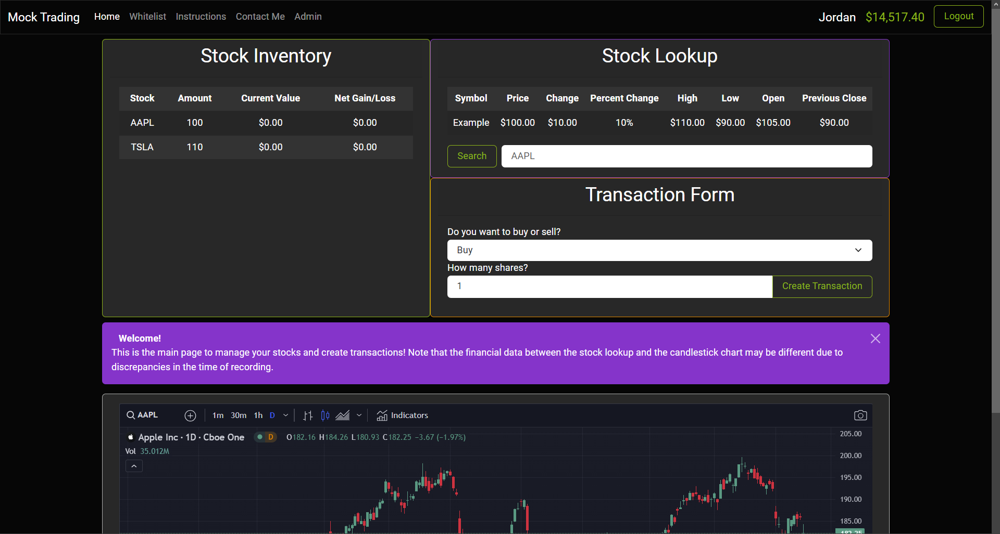
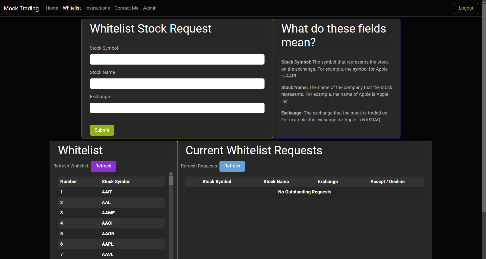

# mock-trading Project

## Info

This project was created for the purpose of allowing my economics class in high school to utilize paper trading for a class project on stocks. It stores user data on what stocks that have bought and sold, and allows them to view their portfolio and see how much money they have made or lost. It also allows the teacher to view all of the students' portfolios and see which stocks they have purchased, how much money they have, etc. The teacher can also whitelist stocks that the students are allowed to trade, and the students can request for a stock to be whitelisted. The teacher can also view the students' requests and approve or deny them. This project support any valid email to sign up as well as password reset emails. The project is currently hosted at https://mock-trading.com/.

The framework uses Quarkus, which makes it easy to connect to a database and create a REST API. The frontend is written with HTML using Bootstrap for styling and JavaScript for functionality. The database is a PostgreSQL and the entire project is ran in a Kubernetes cluster.

## Screenshots

These screenshots show examples of what the frontend looks like. Note that non-admin users will not be able to see some tabs or containers.





This project uses Quarkus, the Supersonic Subatomic Java Framework.

If you want to learn more about Quarkus, please visit its website: https://quarkus.io/ .

## Running the application in dev mode

You can run your application in dev mode that enables live coding using:

```shell script
./mvnw compile quarkus:dev
```

> **_NOTE:_**  Quarkus now ships with a Dev UI, which is available in dev mode only at http://localhost:8080/q/dev/.

## Packaging and running the application

The application can be packaged using:

```shell script
./mvnw package
```

It produces the `quarkus-run.jar` file in the `target/quarkus-app/` directory. Be aware that it’s not an _über-jar_ as
the dependencies are copied into the `target/quarkus-app/lib/` directory.

The application is now runnable using `java -jar target/quarkus-app/quarkus-run.jar`.

If you want to build an _über-jar_, execute the following command:

```shell script
./mvnw package -Dquarkus.package.type=uber-jar
```

This is the end of the file!

The application, packaged as an _über-jar_, is now runnable using `java -jar target/*-runner.jar`.

## Creating a native executable

You can create a native executable using:

```shell script
./mvnw package -Pnative
```

Or, if you don't have GraalVM installed, you can run the native executable build in a container using:

```shell script
./mvnw package -Pnative -Dquarkus.native.container-build=true
```

You can then execute your native executable with: `./target/mock-trading-1.0-SNAPSHOT-runner`

If you want to learn more about building native executables, please consult https://quarkus.io/guides/maven-tooling.
